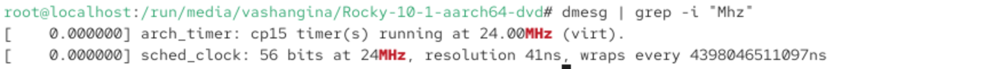
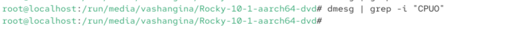
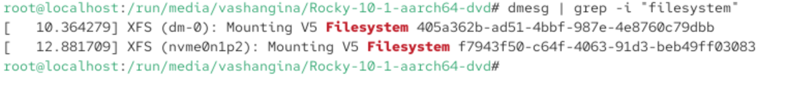
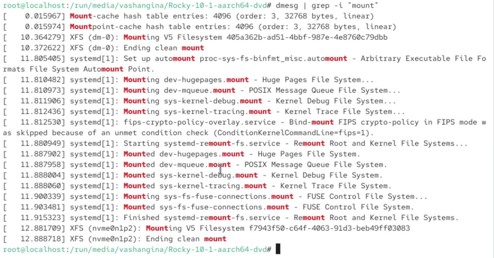

---
## Front matter
lang: ru-RU
title: Лабораторная работа №1
subtitle: Основы информационной безопасности
author:
  - Шангина В. А., НКАбд-04-24
institute:
  - Российский университет дружбы народов, Москва, Россия
date: 20 февраля 2026

## i18n babel
babel-lang: russian
babel-otherlangs: english

## Formatting pdf
toc: false
toc-title: Содержание
slide_level: 2
aspectratio: 169
section-titles: true
theme: Madrid
header-includes:
 - \metroset{progressbar=frametitle,sectionpage=progressbar,numbering=fraction}
 - '\makeatletter'
 - '\beamer@ignorenonframefalse'
 - '\makeatother'
 
## Fonts
#mainfont: PT Serif
#romanfont: PT Serif
#sansfont: PT Sans
#monofont: PT Mono
#mainfontoptions: Ligatures=TeX
#romanfontoptions: Ligatures=TeX
#sansfontoptions: Ligatures=TeX,Scale=MatchLowercase
#monofontoptions: Scale=MatchLowercase,Scale=0.9

mainfont: DejaVu Serif
sansfont: DejaVu Sans
monofont: DejaVu Sans Mono
---

# Вводная часть

## Цель работы

Целью данной работы является приобретение практических навыков установки операционной системы на виртуальную машину, настройки минимально необходимых для дальнейшей работы сервисов.

# Выполнение лабораторной работы

## Создание виртуальной машины

Скачиваем Rocky Linux (рис. 1)

{#fig:001 width=70%}

## Создание виртуальной машины

Открываем VirtualBox и создаём новую виртуальную машину

Указываем имя виртуальной машины, определяем тип операционной системы и указываем путь к iso-образу.

## Создание виртуальной машины

Далее указываем размер оперативной памяти виртуальной машины - 4096 МБ и число процессоров - 2.

## Создание виртуальной машины

Задаём размер виртуального жёсткого диска - 20 ГБ.

## Создание виртуальной машины

Далее запускаем виртуальную машину (рис. 5)

{#fig:005 width=50%}

## Установка операционной системы

После запуска устанавливаем английский язык интерфейса (рис. 6)

{#fig:006 width=60%}

## Установка операционной системы

Добавляем русскую раскладку клавиатуры (рис. 7)

{#fig:007 width=40%}

## Установка операционной системы

Скорректируем часовой пояс (рис. 8)

{#fig:008 width=30%}

## Установка операционной системы

В разделе выбора программ указываем в качестве базового окружения Server with GUI, а в качестве дополнения — Development Tools (рис. 9)

{#fig:009 width=50%}

## Установка операционной системы

Далее отключаем KDUMP, а место установки ОС оставляем без изменения (рис. 10), (рис. 11)

{#fig:010 width=40%}

## Установка операционной системы

Включаем сетевое соединение и в качестве имени узла указываем user.localdomain, где вместо user имя нашего пользователя в соответствии с соглашением об именовании (рис. 12)

{#fig:012 width=40%}

## Установка операционной системы

Устанавливаем пароль для root, разрешение на ввод пароля для root при использовании SSH (рис. 13)

{#fig:013 width=70%}

## Установка операционной системы

Затем задаём локального пользователя с правами администратора и пароль для него (рис. 14) 

{#fig:014 width=70%}

## Установка операционной системы

Начинаем установку операционной системы (рис. 15), (рис. 16)

{#fig:015 width=40%}

## Установка операционной системы

{#fig:016 width=70%}

## После установки

После установки ОС и перезапуска ВМ входим в ОС под заданной нами при установке учётной записью (рис. 17)

{#fig:017 width=40%}

## После установки

Далее через терминал подключаем образ диска дополнений гостевой ОС: (рис. 18)

- заходим в пользователя root, с помощью *sudo -i*

- переходим в каталог /run/media/имя_пользователя/VBox_GAs_версия/

- запускаем Rocky-10-1-aarch64-dvd/ (так как я работаю на MacOS)

## После установки

{#fig:018 width=70%}

## Установка имени пользователя и названия хоста

При установке виртуальной машины мы задали имя пользователя и имя хоста, удовлетворяющее соглашению об именовании. На моей операционной системе MacOS не получилось запустить образ диска дополнений гостевой ОС, поэтому я пропускаю этот шаг.

{#fig:021 width=50%}

# Домашнее задание

## Домашнее задание

В окне терминала проанализируем последовательность загрузки системы, выполнив команду *dmesg* (рис. 19)

{#fig:019 width=70%}

## Домашнее задание

Далее посмотрим вывод этой команды с помощью *dmesg | less* (рис. 20), (рис. 21)

{#fig:020 width=70%}

## Домашнее задание

{#fig:021 width=70%}

## Домашнее задание

Далее получаем следующую информацию:

1. Версия ядра Linux (Linux version) (рис. 22)
2. Частота процессора (Detected Mhz processor) (рис. 23)
3. Модель процессора (CPU0) (рис. 24)
4. Объем доступной оперативной памяти (Memory available) (рис. 25)
5. Тип обнаруженного гипервизора (Hypervisor detected) (рис. 26)
6. Тип файловой системы корневого раздела (рис. 27)
7. Последовательность монтирования файловых систем (рис. 28)

## Домашнее задание

{#fig:022 width=70%}

## Домашнее задание

{#fig:023 width=70%}

## Домашнее задание

{#fig:024 width=70%}

## Домашнее задание

{#fig:025 width=70%}

## Домашнее задание

{#fig:026 width=70%}

## Домашнее задание

{#fig:027 width=70%}

## Домашнее задание

{#fig:028 width=70%}

# Контрольные вопросы

## Контрольные вопросы

1. **Какую информацию содержит учётная запись пользователя?**

Учётная запись, как правило, содержит сведения, необходимые для опознания пользователя при подключении к системе, сведения для авторизации и учёта. Это идентификатор пользователя (login) и его пароль.

## Контрольные вопросы

2. **Укажите команды терминала и приведите примеры:**

- для получения справки по команде используют *help*
- для перемещения по файловой системе используют *cd*
- для просмотра содержимого каталога используют *ls*
- для определения объёма каталога используют *du*
- для создания/удаления каталогов используют *mkdir/rmdir*, а для файлов *touch/rm*
- для задания определённых прав на файл/каталог используют *chmod*
- для просмотра истории команд используют *history*

## Контрольные вопросы

3. **Что такое файловая система? Приведите примеры с краткой характеристикой.**

Файловая система (англ. file system) — порядок, определяющий способ организации, хранения и именования данных во внешней памяти, и обеспечивающий пользователю удобный интерфейс при работе с такими данными.

Примеры:
- FAT — классическая архитектура, используется для флеш-накопителей
- NTFS — стандартная файловая система для Windows NT
- Ext4 — журналируемая файловая система, используемая в Linux

## Контрольные вопросы

4. **Как посмотреть, какие файловые системы подмонтированы в ОС?**

Следует ввести команду *df*.

5. **Как удалить зависший процесс?**

Чтобы удалить зависший процесс, надо сначала узнать его PID с помощью команды *ps*. А после этого ввести *kill <PID процесса>*.

# Подведение итогов

## Выводы

В ходе выполнения лабораторной работы мы приобрели практические навыки установки операционной системы на виртуальную машину, настройки минимально необходимых для дальнейшей работы сервисов.

## Список литературы

1. Лабораторная работа №1 [Электронный ресурс] URL: https://esystem.rudn.ru/pluginfile.php/2580975/mod_folder/content/0/001-lab_virtualbox.pdf
2. VirtualBox [Электронный ресурс] URL: https://www.virtualbox.org/wiki/Linux_Downloads
3. Rocky Linux [Электронный ресурс] URL: https://rockylinux.org/ru-RU/download:::
