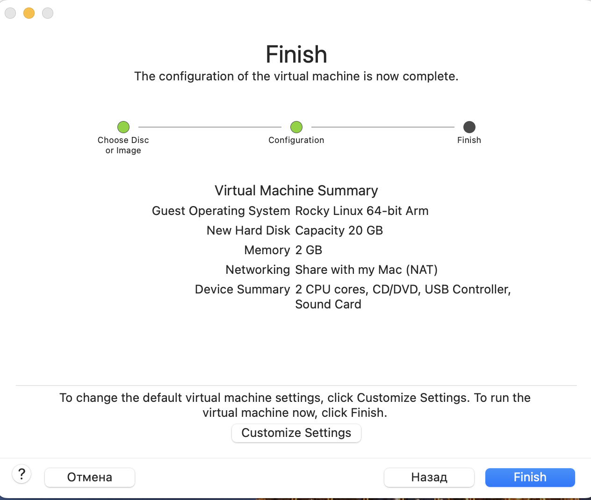
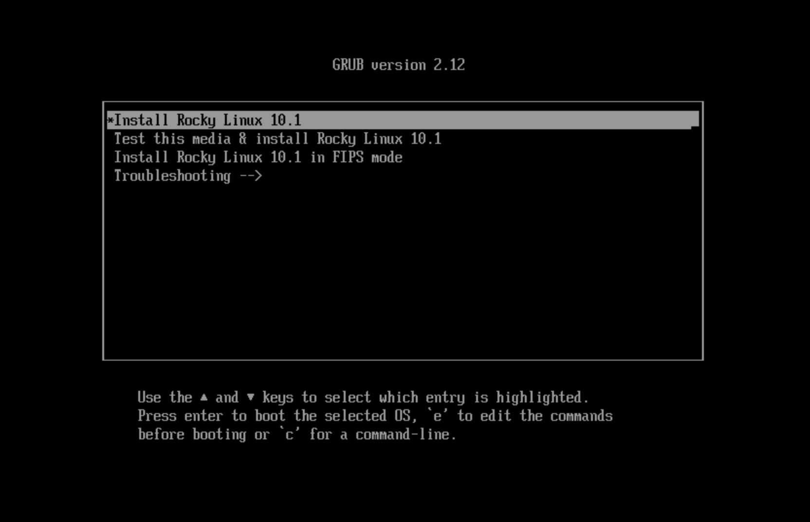
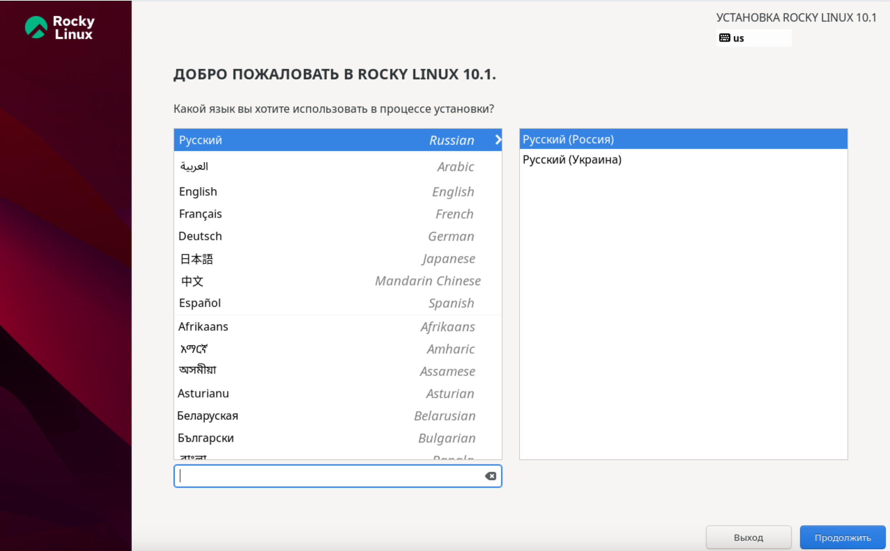
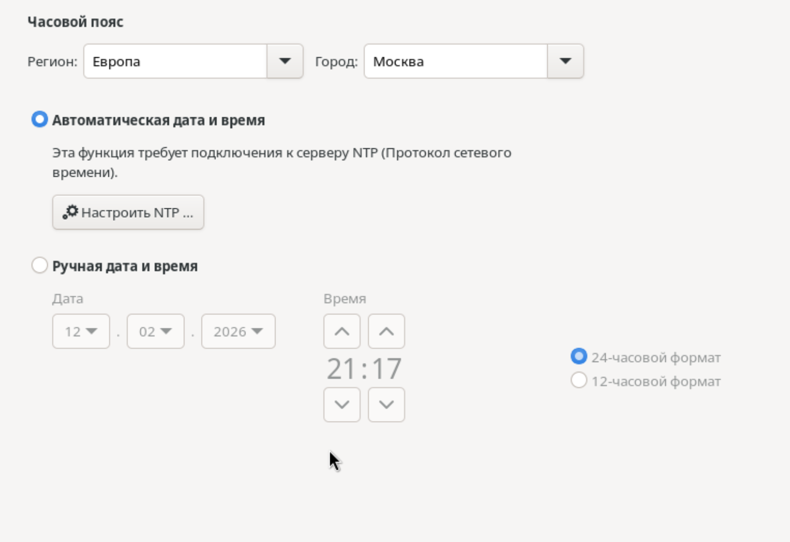
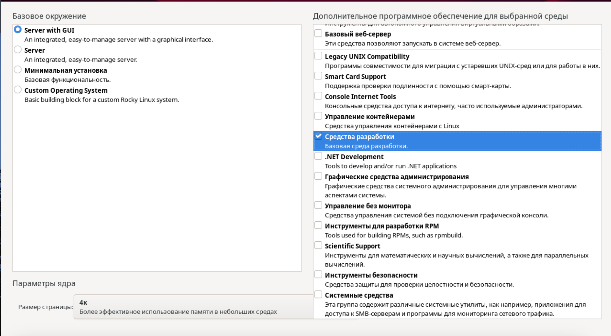
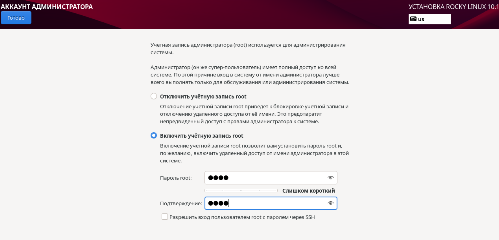
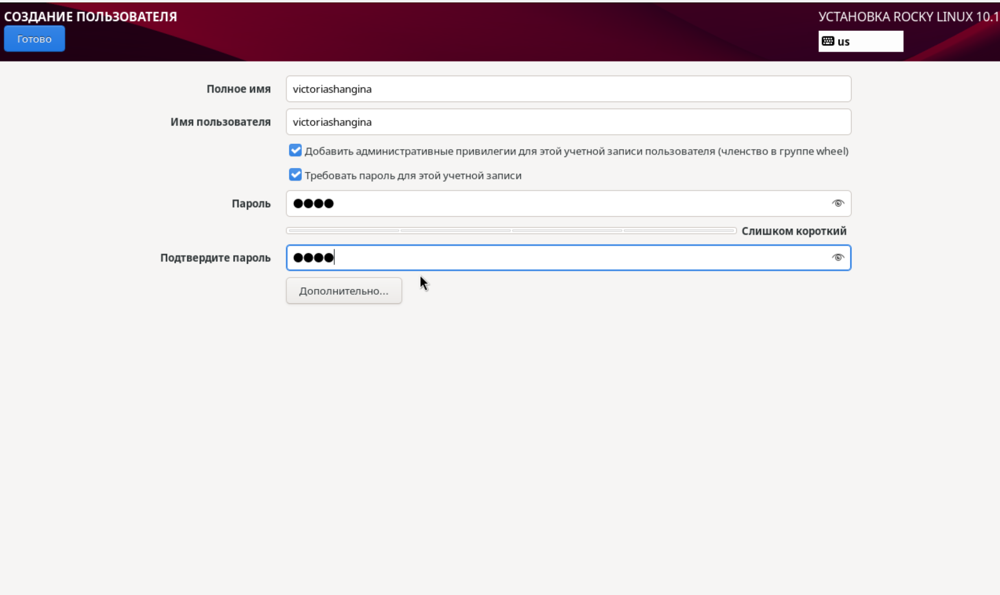
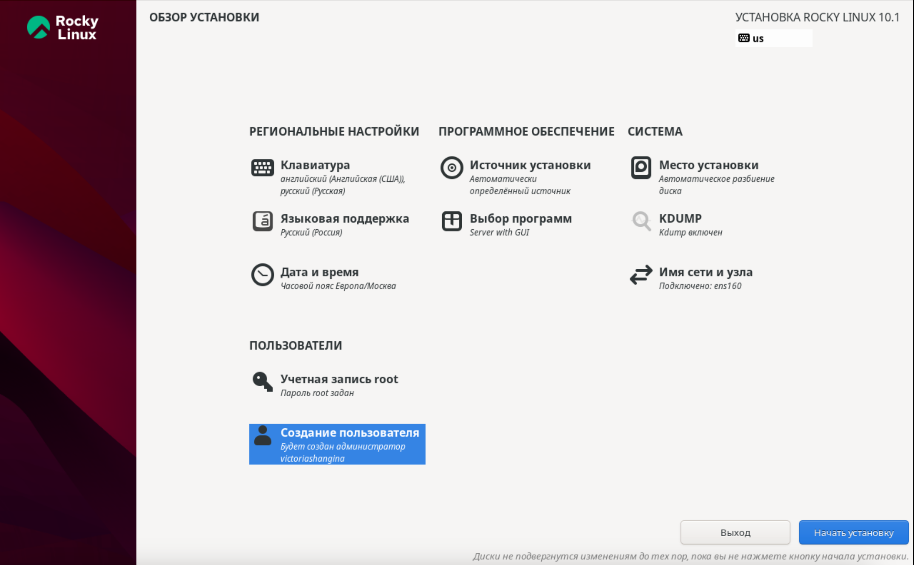

## Цель работы

Приобретение практических навыков установки операционной системы на виртуальную машину, настройки минимально необходимых для дальнейшей работы сервисов.

---

## Создание виртуальной машины

**Шаг 1:** Скачиваем Rocky Linux


---

## Создание виртуальной машины

**Шаг 2:** Создаём новую виртуальную машину в VirtualBox



---

## Создание виртуальной машины

**Шаг 3:** Настройка параметров

- Оперативная память: **4096 МБ**
- Процессоры: **2**
- Жёсткий диск: **20 ГБ**

---

## Создание виртуальной машины

**Шаг 4:** Запуск виртуальной машины



---

## Установка операционной системы

**Шаг 5:** Выбор языка интерфейса



---

## Установка операционной системы

**Шаг 6:** Настройка раскладки клавиатуры


---

## Установка операционной системы

**Шаг 7:** Настройка часового пояса



---

## Установка операционной системы

**Шаг 8:** Выбор программного обеспечения

- Базовое окружение: **Server with GUI**
- Дополнения: **Development Tools**



---

## Установка операционной системы

**Шаг 9:** Настройка дисков

- Место установки: **оставляем без изменения**
- KDUMP: **отключаем**


---

## Установка операционной системы

**Шаг 10:** Настройка сети

- Включаем сетевое соединение
- Имя узла: **user.localdomain**


---

## Установка операционной системы

**Шаг 11:** Установка пароля для root



---

## Установка операционной системы

**Шаг 12:** Создание пользователя

- Локальный пользователь
- Права администратора



---

## Установка операционной системы

**Шаг 13:** Начало установки




---

## После установки

**Шаг 14:** Вход в систему


---

## После установки

**Шаг 15:** Подключение дополнений гостевой ОС

```bash
sudo -i
cd /run/media/username/VBox_GAs_version/
./VBoxLinuxAdditions.run
