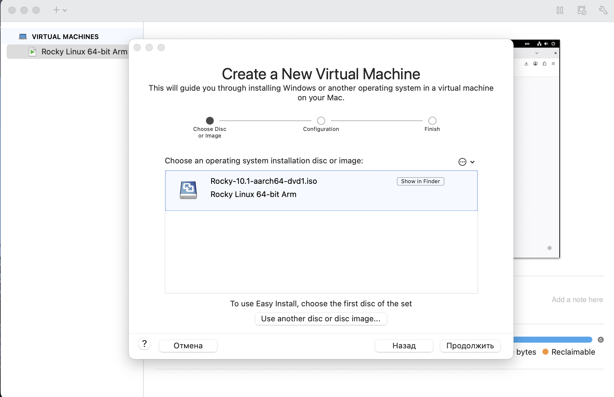
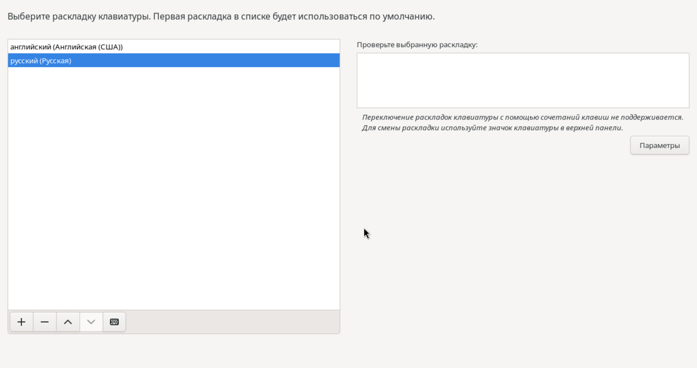
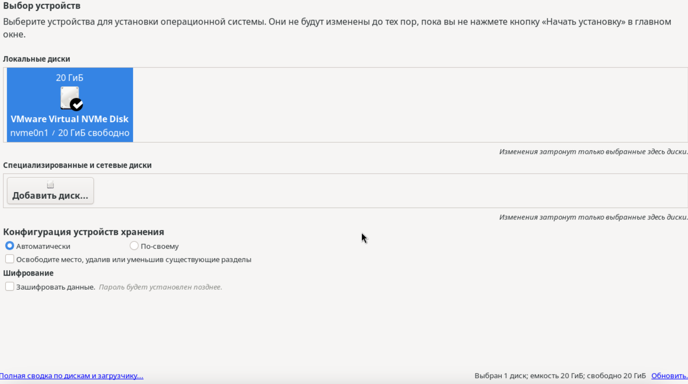
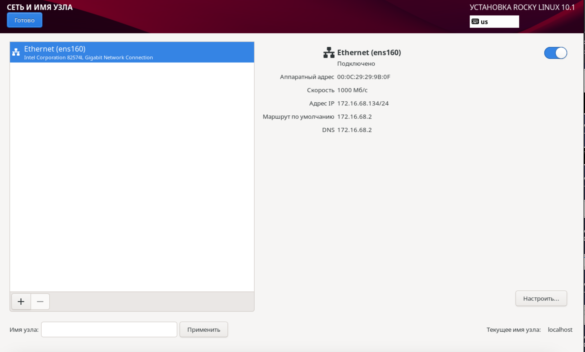
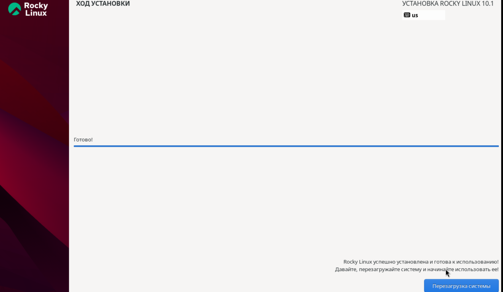
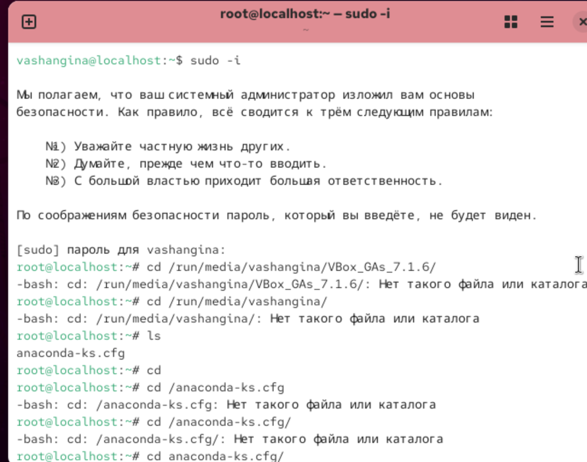
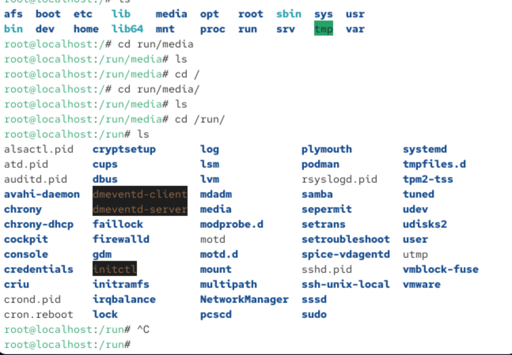
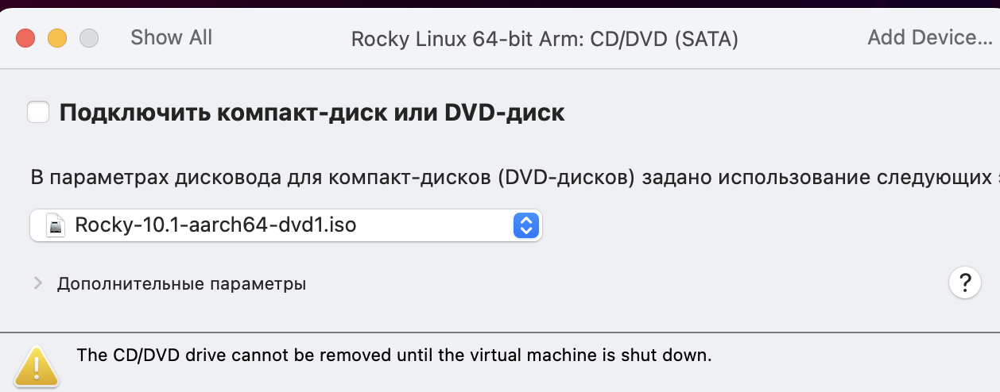

---
## Front matter
title: "Отчёт по лабораторной работе №1"
subtitle: "Дисциплина: Основы информационной безопасности"
author: "Шангина Виктория Андреевна"

## Generic otions
lang: ru-RU
toc-title: "Содержание"

## Bibliography
bibliography: bib/cite.bib
csl: pandoc/csl/gost-r-7-0-5-2008-numeric.csl

## Pdf output format
toc: true # Table of contents
toc-depth: 2
lof: true # List of figures
lot: true # List of tables
fontsize: 12pt
linestretch: 1.5
papersize: a4
documentclass: scrreprt
## I18n polyglossia
polyglossia-lang:
  name: russian
  options:
	- spelling=modern
	- babelshorthands=true
polyglossia-otherlangs:
  name: english
## I18n babel
babel-lang: russian
babel-otherlangs: english
## Fonts
mainfont: PT Serif
romanfont: PT Serif
sansfont: PT Sans
monofont: PT Mono
mainfontoptions: Ligatures=TeX
romanfontoptions: Ligatures=TeX
sansfontoptions: Ligatures=TeX,Scale=MatchLowercase
monofontoptions: Scale=MatchLowercase,Scale=0.9
## Biblatex
biblatex: true
biblio-style: "gost-numeric"
biblatexoptions:
  - parentracker=true
  - backend=biber
  - hyperref=auto
  - language=auto
  - autolang=other*
  - citestyle=gost-numeric
## Pandoc-crossref LaTeX customization
figureTitle: "Рис."
tableTitle: "Таблица"
listingTitle: "Листинг"
lofTitle: "Список иллюстраций"
lotTitle: "Список таблиц"
lolTitle: "Листинги"
## Misc options
indent: true
header-includes:
  - \usepackage{indentfirst}
  - \usepackage{float} # keep figures where there are in the text
  - \floatplacement{figure}{H} # keep figures where there are in the text
---

# Цель работы

Целью данной работы является приобретение практических навыков установки операционной системы на виртуальную машину, настройки минимально необходимых для дальнейшей работы сервисов.

# Выполнение лабораторной работы

## Создание виртуальной машины

Скачиваем Rocky Linux (рис. [-@fig:001])

{#fig:001 width=70%}

Открываем VirtualBox и создаём новую виртуальную машину 

Указываем имя виртуальной машины, определяем тип операционной системы и указываем путь к iso-образу (рис. [-@fig:002])

{#fig:002 width=70%}

Далее указываем размер оперативной памяти виртуальной машины - 4096 МБ и число процессоров - 2 (рис. [-@fig:003])

{#fig:003 width=70%}

Задаём размер виртуального жёсткого диска - 40 ГБ (рис. [-@fig:004])

{#fig:004 width=70%}

Далее запускаем виртуальную машину (рис. [-@fig:005])

{#fig:005 width=70%}

## Установка операционной системы

После запуска устанавливаем английский язык интерфейса (рис. [-@fig:006])

{#fig:006 width=70%}

Добавляем русскую раскладку клавиатуры (рис. [-@fig:007])

{#fig:007 width=70%}

Скорректируем часовой пояс (рис. [-@fig:008])

{#fig:008 width=70%}

В разделе выбора программ указываем в качестве базового окружения Server with GUI, а в качестве дополнения — Development Tools (рис. [-@fig:009])

{#fig:009 width=70%}

Далее отключаем KDUMP, а место установки ОС оставляем без изменения (рис. [-@fig:010]), (рис. [-@fig:011])

{#fig:010 width=70%}

{#fig:011 width=70%}

Включаем сетевое соединение и в качестве имени узла указываем user.localdomain, где вместо user имя нашего пользователя в соответствии с соглашением об именовании (рис. [-@fig:012])

{#fig:012 width=70%}

Устанавливаем пароль для root, разрешение на ввод пароля для root при использовании SSH (рис. [-@fig:013])

{#fig:013 width=70%}

Затем задаём локального пользователя с правами администратора и пароль для него (рис. [-@fig:014]) 

{#fig:014 width=70%}

Начинаем установку операционной системы (рис. [-@fig:015]), (рис. [-@fig:016])

{#fig:015 width=70%}

{#fig:016 width=70%}

## После установки

После установки ОС и перезапуска ВМ входим в ОС под заданной нами при установке учётной записью (рис. [-@fig:017])

{#fig:017 width=70%}

Далее через терминал подключаем образ диска дополнений гостевой ОС: (рис. [-@fig:018])

- заходим в пользователя root, с помощью *sudo -i*

- переходим в каталог /run/media/имя_пользователя/VBox_GAs_версия/

- запускаем VBoxLinuxAdditions.run 

{#fig:018 width=70%}

## Установка имени пользователя и названия хоста

При установке виртуальной машины мы задали имя пользователя и имя хоста, удовлетворяющее соглашению об именовании. Поэтому нам не надо ничего исправлять. Я просто посмотрю им хоста с помощью *hostnamectl* (рис. [-@fig:019])

{#fig:019 width=70%}

# Домашнее задание

В окне терминала проанализируем последовательность загрузки системы, выполнив команду *dmesg* (рис. [-@fig:020])

{#fig:020 width=70%}

Далее посмотрим вывод этой команды с помошью *dmesg | less* (рис. [-@fig:021]), (рис. [-@fig:022])

{#fig:021 width=70%}

{#fig:022 width=70%}

Далее получаем следующую информацию:

1. Версия ядра Linux (Linux version) (рис. [-@fig:023])
2. Частота процессора (Detected Mhz processor) (рис. [-@fig:024])
3. Модель процессора (CPU0) (рис. [-@fig:025])
4. Объем доступной оперативной памяти (Memory available) (рис. [-@fig:026])
5. Тип обнаруженного гипервизора (Hypervisor detected) (рис. [-@fig:027])
6. Тип файловой системы корневого раздела (рис. [-@fig:028])
7. Последовательность монтирования файловых систем (рис. [-@fig:029])

{#fig:023 width=70%}

{#fig:024 width=70%}

{#fig:025 width=70%}

{#fig:026 width=70%}

{#fig:027 width=70%}

{#fig:028 width=70%}

{#fig:029 width=70%}
 
# Контрольные вопросы + ответы

1. Какую информацию содержит учётная запись пользователя?

Учётная запись, как правило, содержит сведения, необходимые для опознания пользователя при подключении к системе, сведения для авторизации и учёта. Это идентификатор пользователя (login) и его пароль.

2. Укажите команды терминала и приведите примеры:

- для получения справки по команде используют *help*

- для перемещения по файловой системе используют *cd*

- для просмотра содержимого каталога используют *ls*

- для определения объёма каталога используют *du*

- для создания/удаления каталогов используют *mkdir/rmdir*, а для файлов *touch/rm*

- для задания определённых прав на файл/каталог используют *chmod*

- для просмотра истории команд используют *history*

3. Что такое файловая система? Приведите примеры с краткой характеристикой.

Файловая система (англ. file system) — порядок, определяющий способ организации, хранения и именования данных во внешней памяти, и обеспечивающий пользователю удобный интерфейс при работе с такими данными. Простыми словами файловая система - это система хранения файлов и организации каталогов. От файловой системы зависит, как файлы будут кодироваться, храниться на диске и читаться компьютером.

Примеры:

- FAT (англ. File Allocation Table «таблица размещения файлов») — классическая архитектура файловой системы, которая из-за своей простоты всё ещё широко применяется для флеш-накопителей. Используется в дискетах, картах памяти и некоторых других носителях информации. Ранее находила применение и на жёстких дисках.

- NTFS (англ. new technology file system — «файловая система новой технологии») — стандартная файловая система для семейства операционных систем Windows NT фирмы Microsoft.

- Ext4 (англ. fourth extended file system, ext4fs) — журналируемая файловая система, используемая преимущественно в операционных системах с ядром Linux, созданная на базе ext3 в 2006 году.

4. Как посмотреть, какие файловые системы подмонтированы в ОС?

Следует ввести команду df. 

5. Как удалить зависший процесс?

Чтобы удалить зависшй процесс, надо сначала узнать его PID с помощью команды *ps*. А после этого ввести *kill <PID процесса>*. И всё готово!

# Выводы

В ходе выполнения лабораторной работы мы приобрели практические навыки установки операционной системы на виртуальную машину, настройки минимально необходимых для дальнейшей работы сервисов.

# Список литературы

1. Лаборатораня работа №1 [Электронный ресурс] URL: https://esystem.rudn.ru/pluginfile.php/2580975/mod_folder/content/0/001-lab_virtualbox.pdf
2. VirtualBox [Электронный ресурс] URL: https://www.virtualbox.org/wiki/Linux_Downloads
3. Rocky Linux [Электронный ресурс] URL: https://rockylinux.org/ru-RU/download
